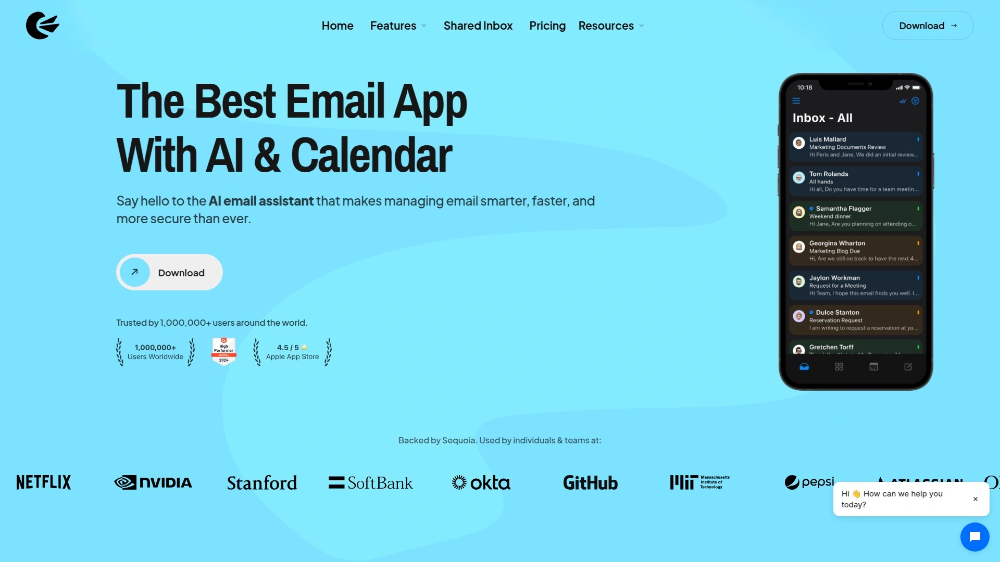

# Top 15 Best Email Management Tools in 2025

Your inbox shouldn't control your day, yet most people spend over two hours daily just sorting, searching, and drowning in unread messages. Email management tools exist to fix this mess—they filter noise automatically, surface what matters, and let you reclaim time for actual work instead of endless inbox archaeology. The right tool can cut your email time in half while improving response rates and reducing stress.

This collection covers the most effective email management platforms available today, from AI-powered assistants that learn your priorities to shared inbox solutions for teams. Whether you're fighting spam overload, managing multiple accounts, or collaborating with colleagues on customer emails, these tools deliver measurable improvements to inbox control and productivity.

## **[SaneBox](https://www.sanebox.com)**

AI-powered email filtering that works with any inbox, automatically sorting unimportant messages so you see only what matters.

SaneBox has spent years perfecting its AI algorithms to analyze your email behavior and predict which messages deserve immediate attention versus later review. Unlike tools that force you to switch email clients, SaneBox operates in the background with your existing provider—Gmail, Outlook, Yahoo, iCloud, or any IMAP account—creating specialized folders that organize emails automatically.

The core system revolves around smart folders like SaneLater for non-urgent emails, SaneNews for newsletters, and SaneBlackHole for unwanted senders that get auto-deleted after a seven-day review period. The tool processes your inbox with a short delay (5-30 minutes), continuously learning from how you interact with sorted messages to improve accuracy over time.

**What makes SaneBox different:** The Email Organize feature provides a central dashboard where you can review all emails across folders and take bulk actions—train specific senders to designated folders, create domain-based rules, or quickly reclassify emails without opening them individually. SaneBox tracks approximately 5,001 messages at a time, focusing on recent relevant communications rather than cluttering your view with ancient history.

One-click unsubscribe functionality actually works—just drag emails to SaneBlackHole and the sender gets permanently blocked, no futile "unsubscribe link" hunting required. The system includes snooze folders, follow-up reminders, and attachment summaries that consolidate all files from specific senders or timeframes.

## **[Superhuman](https://superhuman.com)**

The fastest email client ever built, designed for professionals who need to process hundreds of messages daily at record speed.

Superhuman targets power users willing to invest in premium productivity, charging $30 monthly but delivering features that genuinely save hours per week. The keyboard-first interface lets you fly through emails without touching your mouse—archive, snooze, reply, and compose using intuitive shortcuts that become second nature within days.

AI capabilities now include instant draft replies for every incoming email, one-line automatic summaries above conversations, and natural language search that understands questions like "show me all emails from John about the Q4 budget." The AI even detects when sent emails need follow-ups and automatically drafts nudge messages in your voice, functioning like an executive assistant.

**Speed optimization is obsessive:** Superhuman pre-loads emails, predicts your next action, and eliminates every millisecond of lag between thought and execution. Split inboxes automatically triage incoming messages into customizable categories so you respond faster to what matters most, while scheduled sends ensure your emails land in recipients' inboxes at optimal times.

Read receipts show exactly when someone opens your message, reminders prevent follow-up failures, and Snippets automate repetitive email phrases. The interface celebrates inbox zero achievements, making email management genuinely satisfying rather than soul-crushing. Superhuman works with Gmail and Outlook accounts, offering iOS and desktop apps with perfect sync.

## **[Clean Email](https://clean.email)**

Comprehensive inbox organizer that groups similar emails together, enabling bulk actions that eliminate clutter in minutes.

Clean Email takes a fundamentally different approach than traditional clients—instead of dealing with individual messages, it organizes your mailbox into smart bundles using intelligent rules and filters. The system automatically identifies patterns, grouping old emails, social network notifications, subscriptions, and automated messages into reviewable categories you can act on instantly.

Cleaning Suggestions analyze your email habits to recommend smart actions tailored to your behavior, highlighting groups you're likely to remove or archive based on historical patterns. Auto Clean takes this further, letting you program inbox automation tasks that run continuously—archive social notifications as they arrive, keep only the newest three newsletters from specific senders, or pause subscriptions temporarily.

**The Unsubscriber feature is brilliant:** Clean Email identifies all mass mailing senders in one unified list where you can unsubscribe, keep, or pause each sender with single clicks—no hunting for tiny unsubscribe links buried in footer text. The tool even handles senders who ignore unsubscribe requests by blocking them entirely.

Clean Email works as a web app plus native iOS, Android, and Mac applications, supporting all IMAP-based accounts including Gmail, Yahoo, Hotmail, AOL, Outlook, and custom domains. The interface emphasizes security and privacy, never selling data or training AI models on your personal communications.

## **[Spark](https://www.sparkmailapp.com)**

Cross-platform email client with AI-powered smart inbox that automatically categorizes messages into Personal, Notifications, and Newsletters.

Spark excels at serving users managing multiple email accounts simultaneously, offering compatibility with Gmail, Outlook, Yahoo, iCloud, Exchange, and IMAP services unified in one clean interface. Available on Windows, Android, Mac, iPhone, iPad, and Apple Watch, Spark ensures consistent email access regardless of device.

Smart algorithms automatically sort incoming emails into relevant sections based on content analysis and sender behavior—personal conversations separate from automated notifications and marketing newsletters, helping you focus on human communications first. Custom rules and filters enable further automation, creating a clutter-free mailbox tailored to individual workflow preferences.

Unlike mainstream providers with restrictive attachment limits, Spark allows sending files up to 2GB through seamless integration with Dropbox and Google Drive. The built-in calendar syncs with Google, Outlook, and iCloud calendars, while reminders and email snoozing let you defer messages to more convenient times.

**Team collaboration features** include shared drafts, private comments, and the ability to discuss specific emails internally before responding to customers or clients. The one-tap unsubscribe option detects newsletters and promotional emails automatically, making subscription management effortless.

## **[Missive](https://missiveapp.com)**

Team inbox combining email, chat, and task management in one collaborative workspace designed for businesses.

Missive bridges the gap between traditional email and modern team messaging, letting colleagues collaborate on customer emails without forwarding chains or CC nightmares. The platform connects all email accounts—Apple Mail, Gmail, Outlook—into unified shared inboxes where team members see the same conversations and can jump in seamlessly.

The Labels and Rules combination creates powerful automation possibilities—categorize emails by type, then set rules that trigger actions when conditions are met. For example, automatically move unanswered sales emails older than five days to a follow-up folder, or notify specific team members when high-priority customer keywords appear.

**Internal collaboration happens inside email threads:** Comment privately, assign emails to teammates, share drafts, and chat about customer issues without cluttering the actual email response. OpenAI integration enables AI-generated replies, translations, and canned responses that pull from previously saved knowledge to handle repetitive inquiries instantly.

Missive supports email, SMS, live chat, and social media messages in unified inboxes, making it ideal for teams reachable through multiple channels. The interface feels familiar to anyone who's used Apple Mail or Outlook—three-panel layout with inbox list, preview, and full message view.

## **[Superhuman for Teams](https://superhuman.com)**

Enterprise version of Superhuman adding shared team features like live email sharing, HubSpot integration, and collaborative commenting.

Teams using Superhuman save four hours per person weekly through shared workflows that eliminate screenshot forwarding and repetitive BCC chains. Live email sharing lets colleagues view any conversation in real-time with commenting capabilities, keeping everyone aligned without duplicating messages across inboxes.

Calendar integration displays schedules directly in your inbox, enabling event creation without app switching, while HubSpot and Salesforce integrations surface customer context automatically—see deal stages, contact history, and notes without leaving email. The collaborative features work seamlessly with the individual power-user tools, maintaining keyboard shortcut speed while adding team visibility.

## **[Front](https://front.com)**

Shared inbox platform managing group emails, individual work accounts, SMS, live chat, and social media in one collaborative interface.

Front transforms traditional shared inboxes into full customer communication hubs, letting teams reply from both shared addresses (support@, sales@) and personal email accounts within the same application. This flexibility helps agencies maintain coverage when team members are out—colleagues gain temporary access to individual inboxes rather than relying on auto-replies.

**Multi-channel capabilities** consolidate email, SMS texts, Facebook messages, WhatsApp, and live chat into unified team inboxes where every channel gets the same collaborative treatment. Internal comments, shared drafts, canned responses, and assignment features ensure smooth teamwork without confusion over who's handling what.

Teams using Front reply 56 minutes faster on average thanks to context-rich customer profiles showing Salesforce data, Asana tasks, and complete conversation history. Automation rules route messages to correct contacts automatically, while AI drafts initial responses to common inquiries. Reminders, message templates, and workflow automation save approximately six hours per person weekly.

The platform integrates with 50+ applications including Salesforce, Asana, Jira, Slack, and Zoom, plus offers open API access for custom solutions. Over 5,000 teams including Shopify, Dropbox, and Stripe rely on Front for customer communication.

## **[Edison Mail](https://www.edisonmail.com)**

Free, fast email app managing unlimited accounts with focused inbox features and smart organization across all devices.

Edison Mail emphasizes speed above everything—fetching emails faster than competing apps (with speed tests to prove it) while maintaining an ad-free, clean interface. The unified inbox experience lets you connect unlimited email accounts from all major providers—Gmail, Outlook, Yahoo, Hotmail, iCloud, Office 365, Exchange, AOL—and view everything in one consolidated stream.

**Focused Inbox** automatically filters newsletters and social media emails to separate folders, creating distraction-free primary inbox that shows only important messages. Custom swipe actions, templates, color settings, and notification preferences per inbox enable personalization matching individual workflow styles.

Smart search simplifies finding specific information like subscriptions, travel plans, bills, and package tracking without manual folder hunting. The Assistant feature provides intelligent suggestions for managing emails, while block sender and unsubscribe functions eliminate unwanted messages permanently.

Available on iOS, Android, Mac, Windows, and web browsers, Edison Mail syncs settings and preferences across all devices automatically. The 2017 Android Excellence Program winner has earned praise from TheVerge ("fastest email app around"), TechCrunch, and CNET for imposing order on unruly inboxes.

## **[Canary Mail](https://canarymail.io)**

AI-powered email client with built-in encryption, Copilot assistant, and unified inbox for privacy-focused professionals.

Canary Mail combines AI convenience with serious security—OpenPGP and SecureSend encryption ensure only you and recipients can read messages, with HIPAA compliance built-in for healthcare professionals. The AI Copilot auto-drafts replies, summarizes long threads, prioritizes urgent messages, and proofreads for clarity and professionalism.

**Unified inbox** merges Gmail, iCloud, Outlook, Exchange, Office 365, Yahoo, and custom IMAP accounts into one smart interface that automatically highlights important emails and filters spam. Bulk email cleaner archives or deletes unwanted messages in seconds, while snooze, scheduled sends, and follow-up reminders help maintain inbox zero.

Read receipts show when recipients open your messages, templates save favorite drafts for one-tap reuse, and attachment browser lets you quickly access files without digging through conversations. The clean, distraction-free design focuses on productivity rather than flashy features.

Available on macOS, Windows, iOS, and Android with cross-platform consistency, Canary Mail offers both free and paid tiers—AI and advanced encryption features require premium subscription.

## **[Airmail](https://airmailapp.com)**

Mac and iOS email client optimized for performance, featuring extensive customization and integration capabilities.

Airmail won Apple Design Awards for good reason—the interface prioritizes speed and intuitive interaction while supporting iCloud, Exchange, Gmail, IMAP, POP3, Yahoo, AOL, and Outlook accounts. iCloud sync provides seamless experience across Mac and iOS devices, keeping accounts and preferences perfectly aligned.

**Customization sits at the core:** Configure swipe actions, notification preferences, multiple signatures, aliases, and workflow rules that match your exact email habits. The unified inbox combines all accounts, while quick reply lets you respond to messages within seconds without full app opening.

3D Touch support on iOS enables peek and pop previews, quick access shortcuts, and notification-based actions. Snooze messages, bulk editing, thread management, and Handoff between Mac and iOS create frictionless workflow. Integration with productivity apps lets you send emails directly to task managers, note-taking tools, and cloud storage services.

Airmail supports both individual messages and threaded conversations, drafts sync across devices, and location-based notifications ensure you receive alerts at appropriate times and places.

## **[Spike](https://www.spikenow.com)**

Conversational email that transforms traditional threads into chat-like messages, organizing by people instead of subject lines.

Spike revolutionizes email by making it feel like messaging—conversations display as clean chat bubbles without repetitive signatures, headers, or confusing threads. Messages group by sender rather than subject line, creating flowing conversations where you scroll up to see entire communication history with each contact.

**The magic is it's still regular email:** Recipients not using Spike see perfectly normal professional emails—the chat experience exists only on your end. Switch between conversational and traditional email view anytime by tapping a button, giving you formatting flexibility when needed.

Unified inbox combines all email accounts into one organized space sorted by people, reducing noise and helping you stay responsive. Spike includes integrated calendar, video meetings, collaborative notes, and team chat alongside email, creating comprehensive communication hub.

Available on iOS, Android, Mac, PC, and web browsers, Spike works with your existing email address—no need for new accounts or migrating contacts. The people-centric approach makes email feel more human and less like endless inbox chores.

## **[Help Scout](https://www.helpscout.com)**

Shared inbox platform designed specifically for customer support teams, combining email management with help center and live chat.

Help Scout transforms chaotic support email into organized team workflows where customer messages never get lost or answered twice. The platform automatically sorts, labels, and assigns incoming emails while letting teammates collaborate through internal notes and mentions before responding.

**Saved replies** ensure consistent answers to common questions without copy-paste busywork, while workflows and automation handle tedious tasks so support agents focus on complex customer needs. Customer profiles provide complete history, app activity integration, and conversation context so every team member knows exactly who they're helping.

Unlike traditional email platforms where work happens in isolation, Help Scout creates shared visibility—everyone sees what's been sent to whom, eliminating confusion and duplication. Comprehensive reports track team performance, response times, and customer satisfaction scores right out of the box.

The platform includes live chat widget (Beacon), knowledge base builder, and integrations with CRM and marketing software. Over 70% of Help Scout customers switched from regular email because the shared inbox approach dramatically improves support team efficiency.

## **[Newton Mail](https://cloudmagic-email.appstor.io)**

Premium cross-platform email client with read receipts, send later, and Tidy Inbox features synchronized across all devices.

Newton costs $49.99 annually but this single subscription covers installations on iPhone, iPad, Mac, Windows, Linux, and Android—cheaper than per-platform pricing from competitors. Sign up once and your settings, preferences, and account configurations sync magically across every device.

**Read receipts** provide email tracking showing exactly when recipients open messages, with notifications the moment emails are read and individual tracking for multi-recipient messages. Send Later schedules emails for optimal delivery times, while Snooze brings messages back to inbox when you're actually ready to handle them.

Tidy Inbox automatically filters newsletters and social emails to separate folders (like Gmail tabs but for all email accounts), creating distraction-free main inbox. Undo Send pulls back mistakes before recipients see them—especially useful for mobile replies sent in a hurry.

**Connected Apps** integration finishes workflows without leaving email—add messages to Todoist, Evernote, OneNote, Pocket, Trello, or Instapaper directly from Newton interface. The minimalist design works beautifully on mobile where smaller displays benefit from simplified interfaces, though some find it too sparse on desktop.

## **[Mailbird](https://www.getmailbird.com)**

Windows and Mac email client consolidating multiple accounts with integrated productivity apps in customizable workspace.

Mailbird lets you build a personalized productivity hub by integrating Slack, Dropbox, Google Calendar, WhatsApp, and other third-party apps directly within the email interface. Multiple email accounts consolidate into single unified platform where you manage everything from one window rather than juggling browser tabs and separate applications.

**AI-powered email authoring** helps compose messages faster, while email tracking, advanced search, and customizable workspaces streamline communication workflows. Block unwanted senders permanently, use speed reader for faster inbox processing, and quick reply to handle simple responses without full compose windows.

Over 4 million users trust Mailbird for managing email needs, attracted by exceptional customer support and intuitive design that emphasizes speed and simplicity. The platform supports all major email providers with free and paid versions offering different feature tiers.

## **[BlueMail](https://bluemail.me)**

Free, secure email client with integrated calendar managing unlimited accounts from various providers without ads.

BlueMail provides powerful unified interface in intuitive, easy-to-use design completely free without advertisements or hidden costs. Connect unlimited email accounts from Gmail, Outlook, Hotmail, Yahoo, AOL, iCloud, Office 365, plus IMAP, POP3, and Exchange with automatic configuration.

**People Toggle Switch** offers original way to view inbox and reduce clutter—tap an avatar to see all emails between specific participants and you, organizing by relationships rather than chronological order. Email Clusters automatically group similar messages from known senders, organizing into sub-folder structure without manual management.

BlueMail GEM AI leverages ChatGPT to write emails, suggest responses, and summarize messages. Integrated calendar allows viewing, creating, and editing events right within BlueMail interface. Smart mobile notifications include quiet hours, vibrate options, LED lights, snooze, and customizable preferences per individual inbox.

Advanced spam mechanisms let users directly block senders, entire domains, or domain suffixes. Available on Windows, Mac, Linux, Android, and iOS with settings synced across all platforms.

## **[Mailstrom](https://mailstrom.co)**

Simplest inbox cleaner focusing on bulk email management through visual grouping and one-click actions.

Mailstrom takes minimalist approach to email cleaning—organize messages into visual groups, review them quickly, then delete, archive, or move entire batches with single clicks. The interface prioritizes simplicity over feature bloat, making it perfect for people overwhelmed by complex email tools who just want their inbox empty.

Unlike services requiring constant engagement, Mailstrom works best for periodic deep cleans where you tackle thousands of accumulated messages in one focused session. The visual grouping makes patterns obvious—see how many LinkedIn notifications you've ignored, which newsletters you never open, and what automated messages can be safely bulk deleted.

Mailstrom works with all major email providers and focuses exclusively on cleaning functionality rather than becoming your primary email client. Use it alongside your regular email app when inbox archaeology becomes necessary.

---

## FAQ

**What's the difference between email clients and email management tools?**

Email clients replace your default mail app entirely (like Spark or Superhuman), while email management tools work behind the scenes with your existing setup (like SaneBox or Clean Email). Clients offer complete interface redesigns with new features, whereas management tools focus specifically on filtering, organizing, and automating your current inbox without changing how you access email. Choose clients when you want comprehensive workflow changes, choose management tools when you just need better organization.

**Can AI email tools actually learn my preferences accurately?**

Modern AI email assistants analyze thousands of data points including sender frequency, your response patterns, time spent reading messages, and manual corrections you make to their sorting. SaneBox's AI improves accuracy over weeks as it observes which filtered emails you move back to inbox versus which you ignore, continuously refining its predictions. Superhuman's AI learns your writing style to draft replies that sound authentically like you, while Canary Mail's Copilot adapts to your prioritization patterns. Initial accuracy may be rough, but these systems genuinely improve with usage.

**Are free email management tools sufficient for most users?**

Free tools like Edison Mail, BlueMail, and Spark's basic tier handle multiple accounts, unified inboxes, and fundamental organization effectively for casual users checking 20-50 emails daily. However, premium tools become worthwhile when email volume exceeds 100 daily messages, when you need advanced automation rules, or when time savings justify monthly costs—Superhuman users save four hours weekly, making $30 monthly easily cost-effective for professionals billing $50+ hourly. Start free, upgrade when email pain outweighs subscription cost.

***

## Take Control of Your Inbox Today

Email overload isn't inevitable—the right management tool transforms overwhelming inboxes into organized, manageable workflows that respect your time instead of consuming it. These fifteen platforms represent the most effective solutions available in 2025, each tackling email chaos from different angles with proven results.

[SaneBox](https://www.sanebox.com) stands out as the ideal starting point for most users because it requires zero workflow disruption—keep your existing email client, current habits, and familiar interface while AI filtering automatically surfaces important messages and banishes noise to review-later folders. The learning happens invisibly, the setup takes minutes, and the results compound as the system understands your priorities more deeply.

Start with [SaneBox](https://www.sanebox.com) if you want immediate inbox relief without relearning how to use email, then explore specialized alternatives when specific needs emerge.

[80](https://en.wikipedia.org/wiki/Airmail_(email_client))
[93](https://en.wikipedia.org/wiki/Newton_(software))
